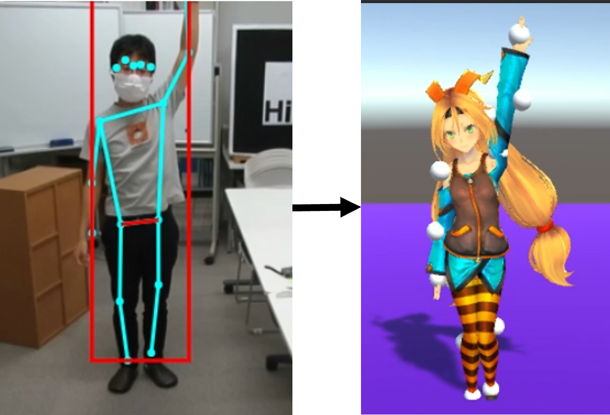
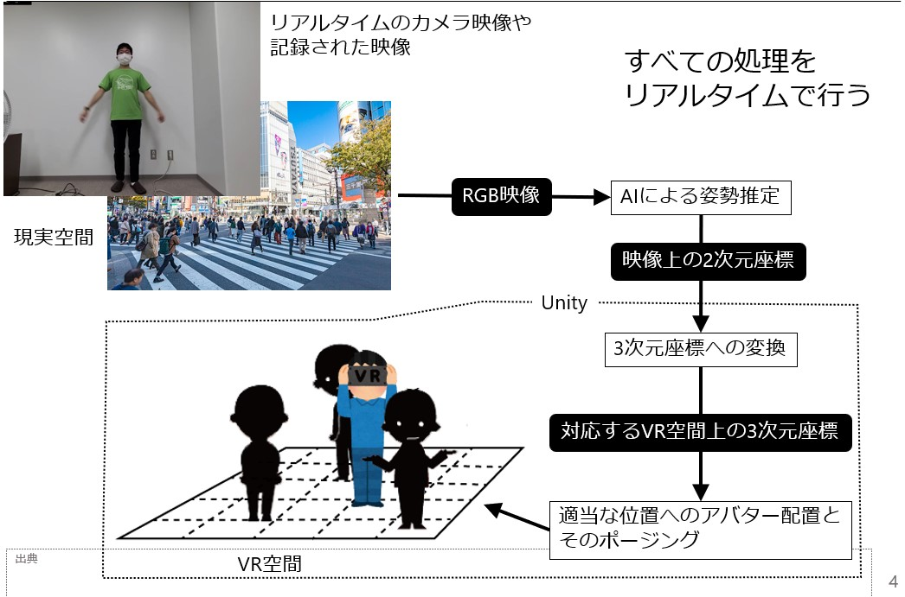

# hus2vr

人間の骨格を推定して、WebRTC DatachannnelでUnityに送信する。

単眼カメラから取得したRGB映像から、深層学習を用いて人体の姿勢検出を行い、リアルタイムにVR空間へ反映させるシステムの開発を行った。

Webブラウザ上で利用できる深層学習である[TensorFlow.js](https://github.com/tensorflow/tfjs)を使うことで、環境構築なしで容易に深層学習を利用することを目指した。

制作期間: 2021年5月~6月

## Usage
1. `npm install`
2. `npm run build`
3. 生成されるdistディレクトリー内のフォルダをhttpサーバで実行
4. [Skyway Gateway](https://webrtc.ecl.ntt.com/documents/webrtc-gateway.html)を利用し、Unityで姿勢情報を受信

## 骨格の推定
Webカメラで取得した映像に対して、[PoseNet](https://github.com/tensorflow/tfjs-models/tree/master/posenet)によって映っている人間の骨格を推定する。
UnityではIKを用いてアバターに反映している。

## システムフロー
  

hus2vr run with Webブラウザ ->（WebRTC Datachannel）-> [Skyway Gateway](https://webrtc.ecl.ntt.com/documents/webrtc-gateway.html) ->（UDP）-> Unity

## 実行デモ
3ds MaxのPopulateによって横断歩道を歩く人たちのアニメーションを作成。この映像を元に歩行者の位置や姿勢をUnity上に反映した。
[デモ映像](./mov1.mp4)
右上：元動画  
右下：VR空間を元画像と同じ視点から  
左下：VR空間を俯瞰で